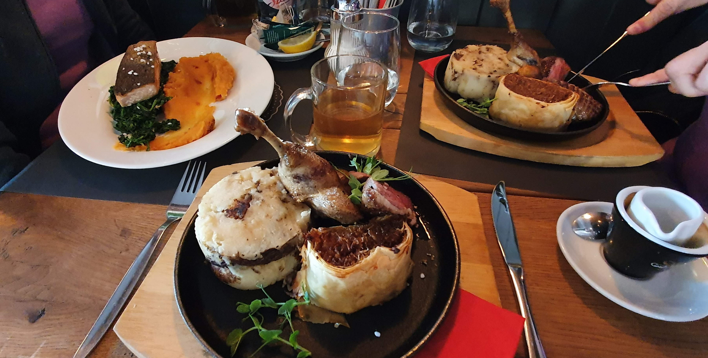

# Restaurant Booking System

## Purpose of the Project

Restaurant Booking System is a Django web application designed for managing restaurant reservations. The application provides features for both customers and staff to handle reservations, manage tables, and ensure a smooth dining experience.



## OK - Technologies Used
### OK - Languages
- **Python**: The core language used for backend logic in Django.
- **HTML5**: Used for structuring the web pages.
- **CSS3**: Used for styling the web pages and making them responsive.
- **JavaScript**: Used for interactive features and form validation.

### OK - Frameworks, Libraries, and Tools
- **Django 4.2**: The main web framework used to build the project.
- **Bootstrap 5**: Used for responsive design and layout.
- **Django Allauth**: For user authentication and email verification.
- **TODO - to uninstall** - **Django Summernote**: For rich text editing within forms.
- **PostgreSQL**: The database used for storing reservation and user data.
- **Gunicorn**: The Python WSGI HTTP Server used for deployment.
- **Heroku**: For hosting the live version of the application.
- **Git**: Version control system for tracking changes in the project.
- **GitHub**: For hosting the project repository.
- **Cloudinary**: For managing static and media files in production.
- **Whitenoise**: For serving static files in production.
- **Google Fonts**: For custom fonts on the website.
- **Font Awesome**: For icons used in the navigation bar and footer.
- **TODO - MAYBE** - **jQuery**: For front-end interaction and user interface elements.

## TODO - Supported screens and browsers
The website was developed and tested on Google Chrome. It's working correctly for Small screen sizes, like Galaxy Fold, as well as for large screens. File style.css optimizes web for these screen width changes: 365px and 487px.

*Image was generated using this [blog](https://ui.dev/amiresponsive?url=https%3A%2F%2Fusersnap.com%2Fblog)

## OK - Installation
### Prerequisites
- Python 3.8 or later
- Django 4.2 or later
- PostgreSQL or another supported database
- Email service for sending confirmation emails

### OK - Steps to Set Up
- __Clone the Repository__
  ```bash
  git clone https://github.com/houndhunger/django-restaurant-web-and-booking.git
  cd django-restaurant-web-and-booking
  ```
## OK - Deployment
The Restaurant Booking System can be hosted on a web server to provide online access. It is designed for easy integration into existing websites or platforms used by restaurants. This allows restaurants to seamlessly add the booking functionality to their operations and manage reservations effectively.

### Via Gitpod
1. Upon starting the Gitpod online workspace,
2. I initiated a Python web server using the command: ```"python3 manage.py runserver"```
3. Gitpod prompted me to open the website within its environment.
4. After making updates and saving them on Gitpod,
5. I refreshed the website to reflect the changes.

### Via Heroku
- The website repository is hosted at: [Restaruant booknig system repository](https://github.com/houndhunger/2048)
- The project is deployed to Heroku and publicly accessible. [Restaruant booknig system app](https://houndhunger.github.io/2048/)

To deploy the project, follow these steps:

1. Ensure that you have configured your environment variables in the Heroku dashboard.
2. Push your code to the Heroku remote repository: ```"git push"```
3. Deploy the app on Heroku either by manually deploying through the Heroku dashboard or by enabling automatic deployment for the main branch.

## Features
### Existing Features
- __User Features__
  - **Make Reservations**: Users can book tables for their desired time and date.
  - **View Reservations**: Users can view and manage their existing reservations.
  - **Update Reservations**: Users can update their reservation details if necessary.
  - **Cancel Reservations**: Users can cancel their reservations if plans change.

- __Staff Features__
  - **TODO**:

### Future Enhancements
- __User Features__
  - **Update User details**: User can update own details like Name, password and email address.
  - **Avabiltiy**: On selecting reservation date and time, be inforwed about avaialabe tables for the date and time (avaialabe 0-49%, bussy 50-79%, almost full %80-%99, full 100%). 
  - **Advanced avabiltiy**: - A feature to display a calendar view of table availability, allowing users to easily see and book available slots for different dates and times.

- __Staff Features__
  - **Manage Reservations**: View and manage all reservations made by users.
  - **Manage Tables**: Add, update, or remove tables and their details.
  - **View Table Availability**: Check table availability for any given time slot.

## OK - Authentication
- **Custom Signup**: Users can sign up with email verification to ensure valid email addresses.
- **Email-based Authentication**: Login is handled via email and password, removing the need for a username.
- **Email Confirmation**: After signup, users must confirm their email by following a link sent to their inbox before accessing the site’s features.
- **Login Redirects**: Upon successful login, users are redirected to the welcome page.
- **Logout Redirects**: Users are redirected to the homepage upon logging out.
- **Password Reset**: Users can reset their password via a link sent to their registered email address.
- **Secure Authentication**: Django’s built-in authentication methods, along with password validators, ensure strong security.

## Structure

- __Navigation Bar__
  - The fully responsive navigation bar is present on all pages, providing links to Home, Reservations, Profile, and Contact pages. It ensures easy navigation across devices and maintains a consistent user experience.

  

- __Reservation Management__
  - Customers can make, view, update, and cancel reservations through a user-friendly interface. This feature helps users to manage their dining plans effectively and receive confirmation emails for their bookings.

  

- __Admin Dashboard__
  - The staff dashboard allows users to view and manage all reservations, including adding or updating table information. It provides an overview of current bookings and table availability to assist staff in daily operations.

  

- __Custom Signup and Login__
  - Users can sign up with email verification to ensure valid accounts. The custom signup form is designed to collect essential user details and facilitate secure login and registration processes.

  

- __Email Notifications__
  - Automated email notifications are sent to users upon reservation creation, update, or cancellation. This feature ensures that users receive timely updates and confirmations about their reservations.

  

- __Footer__
  - The footer includes links to social media profiles and contact information. It encourages users to stay connected and provides easy access to additional resources.

  


## REVISIT - Development Process
The development process for this project involved several stages, each addressing different aspects of functionality and user experience:

- **Initial Setup**: 
  - Created the project and booking app, including the setup of essential configurations and initial database deployment.
  - Deployed the application to Heroku and set up secret keys for deployment.

- **Core Functionality Development**: 
  - Implemented the core features of the reservation system, including creating and editing reservations.
  - Developed the table model and incorporated it into the reservation system.
  - Updated the `Reservation` model and `MakeReservationView` to ensure basic booking functionality.

- **Enhancements and Fixes**: 
  - Enhanced the user interface with CSS updates and improvements to user experience.
  - Added and configured the `debug_toolbar` for development purposes.
  - Integrated Allauth for user authentication, replacing native Django forms to ensure a streamlined authentication process.
  - Added Gmail email notification functionality.

- **Advanced Features**: 
  - Implemented AJAX functionality for checking table availability on reservation dates.
  - Improved reservation logic in `ReservationUpdateView` to ensure accurate data handling and table assignment.
  - Added staff role management for reservations, allowing staff to effectively manage and oversee reservations within the system.

- **Ongoing Refinements**: 
  - Continued working on improving the table reservation logic and fixing logical errors.
  - Addressed issues related to URL reversal and reservation preview redirection.

## REVISE - User Stories
- **As a user, I want to be able to register an account**: Users should be able to create an account with email verification to ensure valid email addresses and secure their accounts.
- **As a user, I want to be able to log in and log out securely**: Users should be able to log in with their credentials and log out, with proper redirection after authentication and logout.
- **As a user, I want to be able to book a table**: Users should be able to select a date, time, and number of guests to reserve a table, and receive a confirmation of their reservation.
- **As a user, I want to view and manage my reservations**: Users should be able to view their existing reservations, and cancel or modify them as needed.
- **As an admin, I want to manage reservations**: Admins should be able to view, approve, and manage all reservations from an administrative interface.
- **As an admin, I want to view statistics on reservations**: Admins should be able to generate and view reports on reservation statistics, such as peak times and reservation trends.
- **As a user, I want to receive email notifications**: Users should receive email confirmations for their reservations and notifications for any changes or updates.
- **As a user, I want to receive reminders for my upcoming reservations**: Users should receive reminders a day before their reservation to ensure they remember their booking.
- **As a user, I want to update my profile information**: Users should be able to update their personal information and manage their account settings.
- **As a user, I want to interact with the website on different devices**: The website should be fully responsive, allowing users to interact with it seamlessly on desktops, tablets, and mobile devices.

## Bugs and Issues
### KEEP UPDATING - Solved Bugs
- **Problem with mixing native Django forms and Allauth forms**  
  - **Problem**: There was a conflict when using both native Django forms and Allauth forms in the same project. This caused authentication and form validation issues, such as failing to log in users or improper form handling.  
  - **Solution**: The problem was resolved by exclusively using Allauth forms for user authentication, registration, and account management. This ensured consistent handling of user sessions and authentication processes across the app.

- **Gmail Email Notifications**  
  - **Problem**: Gmail email notifications were not working as expected.  
  - **Issue**: The issue was due to an incorrect definition in `env.py`.  
  - **Solution**: Corrected the definition in `env.py` to properly set the environment variables for email configuration. This adjustment resolved the email notification issue.

- **Reverse for 'edit_reservation' with no arguments not found**  
  - **Problem**: When trying to render the reservation preview page, Django couldn't reverse the URL for `edit_reservation`.  
  - **Issue**: The URL tag in the template was missing the required `pk` argument.  
  - **Solution**: Passed the correct `pk` argument in the URL tag to ensure Django could resolve the route. Updated the URL in the template as ``.

- **Form cleaned data issue in `ReservationUpdateView`**  
  - **Problem**: During form submission, reservation data was not being saved properly, and no tables were being assigned.  
  - **Issue**: The reservation logic was not handling form validation and saving correctly.  
  - **Solution**: Improved reservation logic by handling form validation and saving the reservation correctly if tables were available. Redirected to the `reservation_preview` after successful submission.

- **NoReverseMatch for 'reservation_preview'**  
  - **Problem**: After submitting the reservation form, there was a `NoReverseMatch` error due to the wrong view name in the redirect call.  
  - **Issue**: The `reservation_preview` view was not correctly set up in the URL patterns.  
  - **Solution**: Created the `reservation_preview` view and linked it properly in the URL patterns. Fixed the redirect by ensuring the correct path and `pk` argument were passed.

### KEEP UPDATING - Unsolved Bugs
- **Handling simultaneous reservations with the same table**  
  - **Problem**: There's currently no mechanism in place to prevent two users from reserving the same table at the same time.  
  - **Status**: Needs further development of a locking mechanism or real-time conflict detection to prevent double bookings.

- **Improper form error handling on table unavailability**  
  - **Problem**: When no tables are available for a given reservation, the error message does not clearly indicate the specific issue. It shows a generic error.  
  - **Status**: Requires better error message customization to provide more user-friendly feedback in such cases.

- **Table reservation: Works with logical errors, needs checking**  
  - **Problem**: The table reservation system logic is overcomplicated and needs simplifying and fixing.  
  - **Status**: Requires thorough validation of the basic logic handling the available tables, as well as advanced logic in edge cases where reservations overlap or large groups are split across tables.

- **AJAX Table Check on Reservation Date**  
  - **Problem**: AJAX functionality for checking table availability on reservation date was not working.  
  - **Issue**: The implementation was incomplete and needed further development.  
  - **Solution**: Finalized the AJAX functionality to correctly check table availability and integrate it into the reservation process.


## Testing
### Code validation 
- **HTML**: No errors were found when passing through the [W3C validator](https://validator.w3.org/nu/?doc=https%3A%2F%2Fyour-site-url.com).
- **CSS**: No errors were found when passing through the [Jigsaw validator](https://jigsaw.w3.org/css-validator/validator?uri=https%3A%2F%2Fyour-site-url.com&profile=css3svg&usermedium=all&warning=1&vextwarning=&lang=en#css).

### TODO - Test Cases
...

## OK - Credits
- **Mentor**: Thanks to my mentor for their guidance and support throughout the development of this project.
- **Code Institute Tutor Service**: Special thanks to the Code Institute Tutor Service for their assistance and valuable feedback.
- **ChatGPT Service**: Appreciation to ChatGPT for providing helpful advice and code suggestions during the project development.


## OK - License
This project is open-source and available under the MIT License. Feel free to fork, modify, and distribute the code for educational or commercial purposes.

---

Happy coding!