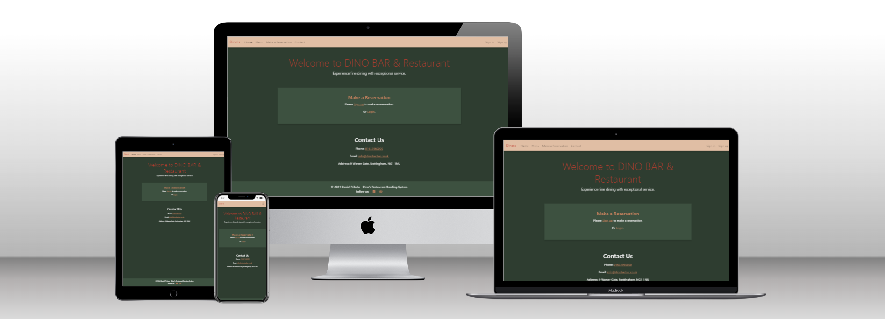

# Restaurant Booking System

## Purpose of the Project

Restaurant Booking System is a Django web application created for Dino Bar and Restaurant, designed for managing restaurant reservations. The application provides features for both customers and staff to handle reservations, manage tables, and ensure a smooth dining experience.


## OK - Technologies Used
### OK - Languages
- **Python**: The core language used for backend logic in Django.
- **HTML5**: Used for structuring the web pages.
- **CSS3**: Used for styling the web pages and making them responsive.
- **JavaScript**: Used for interactive features and form validation.

### OK - Frameworks, Libraries, and Tools
- **Django 4.2**: The main web framework used to build the project.
- **Bootstrap 5**: Used for responsive design and layout.
- **Django Allauth**: For user authentication and email verification.
- **TODO - to uninstall** - **Django Summernote**: For rich text editing within forms.
- **PostgreSQL**: The database used for storing reservation and user data.
- **Gunicorn**: The Python WSGI HTTP Server used for deployment.
- **Heroku**: For hosting the live version of the application.
- **Git**: Version control system for tracking changes in the project.
- **GitHub**: For hosting the project repository.
- **Cloudinary**: For managing static and media files in production.
- **Whitenoise**: For serving static files in production.
- **Google Fonts**: For custom fonts on the website.
- **Font Awesome**: For icons used in the navigation bar and footer.
- **TODO - MAYBE** - **jQuery**: For front-end interaction and user interface elements.

## OK - UPDATE IMAGE - Supported screens and browsers
The website was developed and tested on Google Chrome. It's working correctly for Small screen sizes, like Galaxy Fold, as well as for large screens.

*Image was generated using this [techsini.com website](https://techsini.com/multi-mockup/index.php)

## OK - Installation
### Prerequisites
- Python 3.8 or later
- Django 4.2 or later
- PostgreSQL or another supported database
- Email service for sending confirmation emails

### OK - Steps to Set Up
- **Clone the Repository**
  ```bash
  git clone https://github.com/houndhunger/django-restaurant-web-and-booking.git
  cd django-restaurant-web-and-booking
  ```
## OK - Deployment
The Restaurant Booking System can be hosted on a web server to provide online access. It is designed for easy integration into existing websites or platforms used by restaurants. This allows restaurants to seamlessly add the booking functionality to their operations and manage reservations effectively.

### Via Gitpod
1. Upon starting the Gitpod online workspace,
2. I initiated a Python web server using the command: ```"python3 manage.py runserver"```
3. Gitpod prompted me to open the website within its environment.
4. After making updates and saving them on Gitpod,
5. I refreshed the website to reflect the changes.

### Via Heroku
- The website repository is hosted at: [Restaruant booknig system repository](https://github.com/houndhunger/django-restaurant-web-and-booking/)
- The project is deployed to Heroku and publicly accessible. [Restaruant booknig system app](https://django-restaurant-web-and-book-565ecd4fe61b.herokuapp.com/)

To deploy the project, follow these steps:

1. Ensure that you have configured your environment variables in the Heroku dashboard.
2. Push your code to the Heroku remote repository: ```"git push"```
3. Deploy the app on Heroku either by manually deploying through the Heroku dashboard or by enabling automatic deployment for the main branch.
## DONE - Features

### Existing Features
- **User Features**
  - **Make Reservations**: Users can book tables for their desired time and date.
  - **View Reservations**: Users can view and manage their existing reservations.
  - **Update Reservations**: Users can update their reservation details if necessary.
  - **Cancel Reservations**: Users can cancel their reservations if plans change.
  - **Receive Email Notifications**: Users will receive automatic email confirmations after making, editing, or canceling reservations.
  - **Automate Preferences**: The system will automatically reserve suitable tables based on guest preferences and notify guests if their preferences cannot be fully met.

- **Staff Features**
  - **Manage Reservations**: Staff can view and manage all reservations made by users through the admin interface.
  - **View Table Availability**: Staff can check table availability for any given time slot via the admin interface.
  - **Manage Tables**: Staff can add, update, or remove tables and their details using the admin interface.
  - **Custom Reservation Times**: Apply custom reservation times based on party size and buffer/service time.

### Future Enhancements
- **User Features**
  - **Update Profile Information**: Users will have the ability to manage their personal information, including name, password, and email address, for better reservation details through a dedicated profile page.
  - **Receive Email Notifications and Reminders**: Users will receive automatic email reminders a day before the booking and notifications about upcoming reservations on the morning of their reservation day at a preferred time.
  - **View Reservation Statistics**: Admins will generate reports to analyze trends such as peak hours and busy days, enabling data-driven decision-making.
  - **Availability Indicators**: Users will see real-time availability (0-49% available, 50-79% busy, 80-99% almost full, and 100% full) when selecting reservation dates and times.
  - **Calendar View of Availability**: Users will have a calendar view displaying available slots for different dates and times for easier booking.

### Future Enhancements
- **Staff Features**: 
  - **Manage Reservations - non-admin interfce**: View and manage all reservations made by users through a non-admin user custom interface.
  - **View Table Availability - non-admin interfce**: Check table availability for any given time slot through a non-admin user custom interface.
  - **Manage Tables - non-admin interfce**: Add, update, or remove tables and their details through a non-admin user custom interface.
  - **Enhacced management of Reservations**: Staff will have enhanced tools to efficiently view, approve, and modify reservations made by users through an intuitive admin interface.
  - **View Reservation Statistics**: Staff will be able to generate detailed reports on reservation patterns, helping to identify peak times and improve service efficiency.
  - **Communication Tools**: Staff will have access to communication tools to directly notify users about their reservation status, changes, or special promotions.
  - **Restaurant Table Plan Layout**: Manage the restaurant's table reservations for efficient reservation handling and table assignments.


## OK - Structure

### Interaction Design

- **Navigation Bar**
  - The fully responsive navigation bar is present on all pages, providing links to Home, Menu. For signed in user navigation bar show lins to Make a Reservation, My Reservations, Contact, Profile and Sign out. For not signed in user navigation bar show lins to Sign in, Sign up and Make Reservation which leads to Sign in.
Profile and Log out. It ensures easy navigation across devices and maintains a consistent user experience.

  

- **Reservation Management**
  - Customers can make, view, update, and cancel reservations through a user-friendly interface. This feature helps users to manage their dining plans effectively and receive confirmation emails for their bookings.

  

- **Admin Dashboard**
  - The staff dashboard allows users to view and manage all reservations, including adding or updating table information. It provides an overview of current bookings and table availability to assist staff in daily operations.

  

- **Custom Signup and Login**
  - Users can sign up with email verification to ensure valid accounts. The custom signup form is designed to collect essential user details and facilitate secure login and registration processes.

  

- **Email Notifications**
  - Automated email notifications are sent to users upon reservation creation, update, or cancellation. This feature ensures that users receive timely updates and confirmations about their reservations.

  

- **Footer**
  - The footer includes links to social media profiles and contact information. It encourages users to stay connected and provides easy access to additional resources.
  - For development purposes, phone numbers and email addresses links use fake or reserved domains to prevent accidental emails or real interactions (e.g., info@example.com).

  

### Information Design

- **Entity-Relationship Diagram (ERD)**  
  - The following ERD outlines the relationships between models in the system:

  
  
## REVISIT - Development Process
The development process for this project involved several stages, each addressing different aspects of functionality and user experience:

- **Initial Setup**: 
  - Created the project and booking app, including the setup of essential configurations and initial database deployment.
  - Deployed the application to Heroku and set up secret keys for deployment.

- **Core Functionality Development**: 
  - Implemented the core features of the reservation system, including creating and editing reservations.
  - Developed the table model and incorporated it into the reservation system.
  - Updated the `Reservation` model and `MakeReservationView` to ensure basic booking functionality.

- **Enhancements and Fixes**: 
  - Enhanced the user interface with CSS updates and improvements to user experience.
  - Added and configured the `debug_toolbar` for development purposes.
  - Integrated Allauth for user authentication, replacing native Django forms to ensure a streamlined authentication process.
  - Added Gmail email notification functionality.

- **Advanced Features**: 
  - Improved reservation logic in `ReservationUpdateView` to ensure accurate data handling and table assignment.

- **Ongoing Refinements**: 
  - Continued working on improving the table reservation logic and fixing logical errors.
  - Added staff role management for reservations, allowing staff to effectively manage and oversee reservations within the system.
  - Enhancing the guest experience by making it easier to identify available reservations based on busy days and guest preferences.

## REVISE - User Stories

- **As a user, I want to be able to register an account**:
  -**Problem:** Users need a way to create an account with verified email addresses to ensure security and validity.
  -**Action:** Implement an account registration system that includes email verification as part of the process.
  -**Outcome:** Users can successfully create an account with a verified email address, ensuring that only valid emails are used.

- **As a user, I want to log in and log out securely**
  -**Problem:** Users need to securely log in and out of the system to access and manage their reservations.
  -**Action:** Users log in using their email and password and can log out when done.
  -**Outcome:** After successful authentication, users are redirected to their dashboard. On logout, they are redirected to the homepage.

- **As a user, I want to book a table**
  -**Problem:** Users want to reserve a table for a specific date, time, and party size.
  -**Action:** Users fill out a reservation form, selecting a date, time, guest count, and seating preferences (e.g., quiet, outside seating).
  -**Outcome:** If available, the reservation is confirmed, and a confirmation message is displayed to the user.

- **As a user, I want to view and manage my reservations**
  -**Problem:** Users need the ability to manage their existing reservations, including making changes or cancellations.
  -**Action:** Users view their reservations on the "My Reservations" page, where they can edit or cancel them as needed.
  -**Outcome:** Users can modify or cancel their bookings with immediate feedback on changes.

- **As a user, I want to interact with the website on different devices**
  -**Problem:** Users need to access and navigate the booking system from various devices, such as desktops, tablets, and smartphones.
  -**Action:** The website is designed to be responsive, adjusting layouts and components based on the device's screen size.
  -**Outcome:** Users have a seamless experience across all devices, ensuring easy reservation management on the go.

- **As an admin, I want to manage reservations**
  - **Problem:** Admins need to edit, or cancel reservations to manage the restaurant's capacity efficiently.
  - **Action:** Admins can access the dashboard to handle all reservations and modify them as necessary.
  - **Outcome:** The restaurant's reservation system is kept organized, allowing smooth operation and customer satisfaction.

## Bugs and Issues
### DONE - Solved Bugs
- **Problem with mixing native Django forms and Allauth forms**  
  - **Problem**: There was a conflict when using both native Django forms and Allauth forms in the same project. This caused authentication and form validation issues, such as failing to log in users or improper form handling.  
  - **Solution**: The problem was resolved by exclusively using Allauth forms for user authentication, registration, and account management. This ensured consistent handling of user sessions and authentication processes across the app.

- **Gmail Email Notifications**  
  - **Problem**: Gmail email notifications were not working as expected.  
  - **Issue**: The issue was due to an incorrect definition in `env.py`.  
  - **Solution**: Corrected the definition in `env.py` to properly set the environment variables for email configuration. This adjustment resolved the email notification issue.

- **Reverse for 'edit_reservation' with no arguments not found**  
  - **Problem**: When trying to render the reservation preview page, Django couldn't reverse the URL for `edit_reservation`.  
  - **Issue**: The URL tag in the template was missing the required `pk` argument.  
  - **Solution**: Passed the correct `pk` argument in the URL tag to ensure Django could resolve the route. Updated the URL in the template as ``.

- **Form cleaned data issue in `ReservationUpdateView`**  
  - **Problem**: During form submission, reservation data was not being saved properly, and no tables were being assigned.  
  - **Issue**: The reservation logic was not handling form validation and saving correctly.  
  - **Solution**: Improved reservation logic by handling form validation and saving the reservation correctly if tables were available. Redirected to the `reservation_preview` after successful submission.

- **NoReverseMatch for 'reservation_preview'**  
  - **Problem**: After submitting the reservation form, there was a `NoReverseMatch` error due to the wrong view name in the redirect call.  
  - **Issue**: The `reservation_preview` view was not correctly set up in the URL patterns.  
  - **Solution**: Created the `reservation_preview` view and linked it properly in the URL patterns. Fixed the redirect by ensuring the correct path and `pk` argument were passed.

- **Bootstrap Content Off-Center**
  - **Problem**: Some content of the website is off-center on screens larger than 1200px.
  - **Issue**: This misalignment can lead to an unprofessional appearance and negatively affect user experience.
  - **Solution**: Bad css styling with fixed width. Removing fixed width on specifc class div solved the issue.

- **Table reservation: Works with logical errors, needs checking**  
  - **Problem:** The table reservation system logic is overcomplicated and prone to logical errors, requiring simplification and validation.  
  - **Issue:** Complex logic involving table assignment, zones, and advanced features has led to inconsistent behavior, especially with overlapping reservations or large group bookings.  
  - **Solution:** The logic was stripped down to a simpler approach, assigning tables one by one in sequence. Advanced features such as zone management and other priorities were reintroduced incrementally, ensuring the system remains functional with a clear foundation.

- **Improper form error handling on table unavailability**  
  - **Problem:** When no tables are available for a given reservation, the error message does not clearly indicate the specific issue. It shows a generic error.  
  - **Issue:** Users receive a vague response when their reservation cannot be processed due to unavailable tables, leading to confusion and poor user experience.  
  - **Solution:** Customized error messages are now implemented, providing clear and specific feedback when tables are unavailable, depending on the issue (e.g., fully booked, out of openning hours).  

- **Handling simultaneous reservations with the same table**
  - **Problem:** Previously, there was no mechanism to prevent two users from reserving the same table at the same time.
  - **Action:** The view logic was updated to filter only available tables for the selected reservation time, preventing double bookings.
  - **Outcome:** The system now efficiently handles simultaneous reservation requests, ensuring no table is double-booked during overlapping time slots.

### REVISIT - Unsolved Bugs
   **Flatpickr is too large for small screens**  
  - **Problem**: The Flatpickr datepicker appears oversized and doesn't fit well on smaller screens, making the user experience cumbersome.  
  - **Issue**: The cause is likely due to Flatpickr’s default styling, which isn’t fully responsive out of the box.  
  - **Solution**: Future plans include implementing responsive adjustments or integrating a mobile-friendly datepicker.

  - **Advanced booking - Preferences**
  - **Problem**: The system doesn't consistently accommodate all guest preferences (e.g., quiet area, outdoor seating, etc.).
  - **Issue**: Some preferences are ignored or incorrectly applied during table assignment, leading to unsatisfactory guest experiences.
  - **Solution**: Implement more complex booking logic that ensures preferences are properly respected, along with extensive testing to verify correct behavior.

- **Flatpickr dasn't pop up warning message**  
  - **Problem**: The Flatpickr widget doesn't consistently pop up a warning message when invalid input is entered for the minutes field, particularly when the input does not follow the 5-minute increment rule.  
  - **Issue**: Flatpickr allows manual input if allowInput: true is set, but it doesn't automatically enforce validation or display warnings for values that don't align with the defined minute Increment. Without additional validation logic, the widget may not always catch invalid inputs.
  - **Solution**: Implement custom validation using Flatpickr's onClose or onValueUpdate events to manually validate time inputs. Ensure that invalid entries outside the allowed 5-minute increments trigger a warning message consistently. Alternatively, handle input validation via the form's submission logic or create an inline error display mechanism.
  
## TODO - Testing
### Code validation 
- **HTML**: Following paths have been validated and no errors were found when passing through the [W3C validator](https://validator.w3.org/).
  - [app/](https://django-restaurant-web-and-book-565ecd4fe61b.herokuapp.com/)
  - [app/menu/](https://django-restaurant-web-and-book-565ecd4fe61b.herokuapp.com/menu/)  
  - [app/reservation/make/](https://django-restaurant-web-and-book-565ecd4fe61b.herokuapp.com/reservation/make/)  
  - [app/reservations/](https://django-restaurant-web-and-book-565ecd4fe61b.herokuapp.com/reservations/)  
  - [app/open/](https://django-restaurant-web-and-book-565ecd4fe61b.herokuapp.com/open/)  
  - [app/contact/](https://django-restaurant-web-and-book-565ecd4fe61b.herokuapp.com/contact/)  
  - [app/accounts/logout/](https://django-restaurant-web-and-book-565ecd4fe61b.herokuapp.com/accounts/logout/)  
  - [app/accounts/login/](https://django-restaurant-web-and-book-565ecd4fe61b.herokuapp.com/accounts/login/)  
  - [app/reservation/make/](https://django-restaurant-web-and-book-565ecd4fe61b.herokuapp.com/reservation/make/)  
  - app/reservation/###/edit/ 
  - app/reservation/###/preview/
  - app/delete-reservation/###/

- **CSS**: Following file have been validated and no errors were found when passing through the [Jigsaw validator](https://jigsaw.w3.org/css-validator/).
static/css/style.csshttps://django-restaurant-web-and-book-565ecd4fe61b.herokuapp.com/static/css/style.css)

- **JavaScript**: Following file have been validated and no errors were found when passing through the [jshint.com](https://jshint.com/). New JavaScript features (ES6) settings is turned on. Results show no errors.
[static/css/style.css](https://django-restaurant-web-and-book-565ecd4fe61b.herokuapp.com/static/js/flatpickr.js)

- **Pyton**: Code passes [pep8ci](https://pep8ci.herokuapp.com/) validation with 100% sucess validating following files:
- [booking/reservation_utils.py](booking/utils/reservation_utils.py)  
- [booking/admin.py](booking/admin.py)  
- [booking/forms.py](booking/forms.py)  
- [booking/urls.py](booking/urls.py)  
- [booking/views.py](booking/views.py)  
- [codestar/settings.py](codestar/settings.py)  
- [codestar/urls.py](codestar/urls.py)  
- [codestar/views.py](codestar/views.py)

### TODO - Test Cases
...

## OK - Credits
- **Mentor**: Thanks to my mentor for his guidance and support throughout the development of this project.
- **Code Institute Tutor Service**: Special thanks to the Code Institute Tutor Service for their assistance and valuable feedback.
- **ChatGPT Service**: Appreciation to ChatGPT for providing helpful advice and code suggestions during the project development.


## OK - License
This project is open-source and available under the MIT License. Feel free to fork, modify, and distribute the code for educational or commercial purposes.

---

Happy coding!